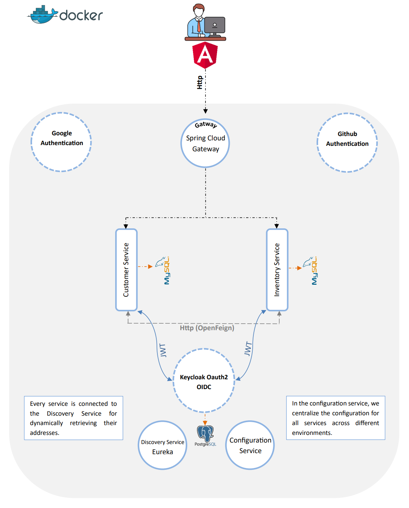
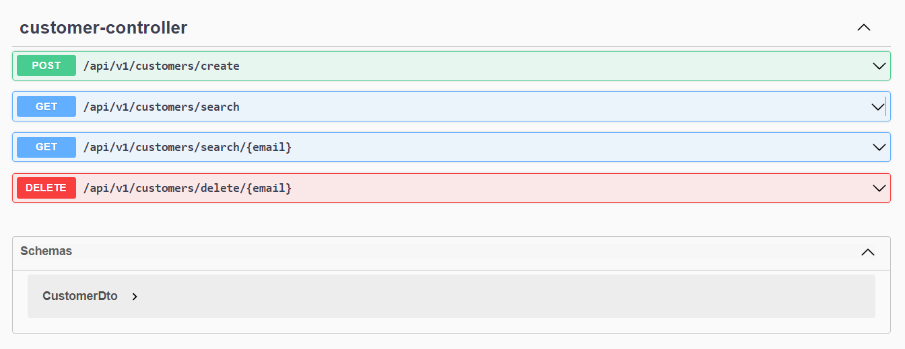
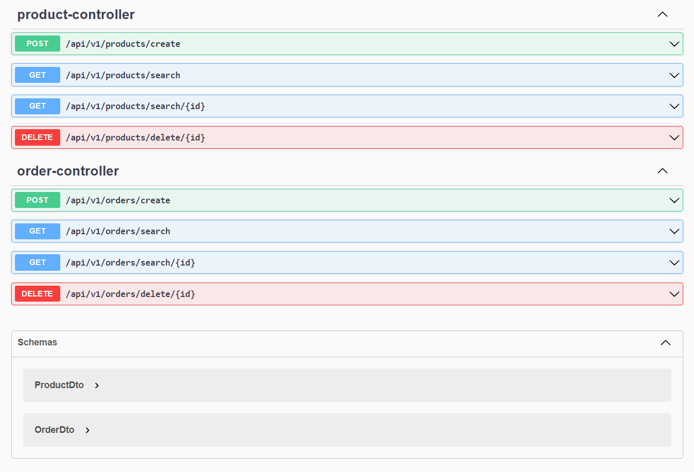

# Inventory Management System with Microservices

## Project Overview
This project implements an inventory management system using a microservices architecture. It integrates various technical services and authentication mechanisms, deployed using Docker.



## Microservices Architecture
- **Discovery Service**: Implemented with Eureka Server for service registration and discovery.
- **Gateway Service**: Utilizes Spring Cloud Gateway for routing and load balancing.
- **Config Service**: Managed with Spring Cloud Config for centralized configuration.

## Core Services
- **Customer Service**: Manages customer information and interactions.
- **Inventory Service**: Handles inventory management, communicating with Customer Service via OpenFeign.

## Authentication
- Authenticated using Keycloak server, supporting backend channels.
- Offers OAuth2 authentication options with Google and GitHub.
- Frontend built with Angular.

## Deployment
- Services are containerized and managed using Docker.

## Getting Started
- Build Modules :
```shell
cd ./{module_name}
mvn clean package
```
- docker compose :
```shell
docker compose up -d
```
## Customer Service Test



## inventory Service Test


